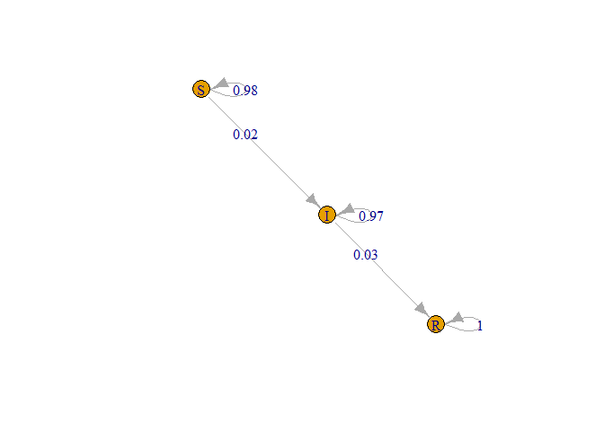

Dynamic stochastic SIR model in infectious disease
================
Joshua Edefo
2024-01-10

Case: An outbreak with infection rate of 2% and recovery rate of 3%

Library

``` r
library(markovchain)
```

    ## Warning: package 'markovchain' was built under R version 4.3.2

Diagram of the transition probability matrix

``` r
mcSIR<-new("markovchain", states=c("S", "I", "R"), 
           transitionMatrix=matrix(data=c(0.98, 0.02, 0, 0, 0.97, 0.03, 0, 0, 1), 
                                   byrow = TRUE, nrow =  3), name = "SIR") 
initialState<-c(100000,1,0)
plot(mcSIR, package = "daigram")
```

<!-- -->

Inputs

``` r
N_psa <- 10000

# R code inside a function
# distribution of transition probabilities using normal distribution
params<-data.frame(
  p_Susceptible_Susceptible   = rbeta(N_psa, 98, 2),
  p_Susceptible_Infected  = rbeta(N_psa,  2, 98),
  p_Susceptible_Recovered  = rbeta(N_psa,  0, 100),
  p_Infected_Susceptible  = rbeta(N_psa,  0, 100),
  p_Infected_Infected = rbeta(N_psa, 97,3),
  p_Infected_Recovered = rbeta(N_psa,  3, 97),
  p_Recovered_Susceptible  = rbeta(N_psa,  0, 100),
  p_Recovered_Infected = rbeta(N_psa,  0,  100),
  p_Recovered_Recovered = rbeta(N_psa, 100, 1)
  
)

model<- function(.params) { 
  with(.params, {
    
    n_t<-40
    n_s<-3
    n_c<-1000
    
    v_state_names<-c("Susceptible", "Infected", "Recovered")
    m_P<-matrix(0, nrow = 3, ncol =3, 
                dimnames = list(from = v_state_names, to = v_state_names ))
    
    m_P["Susceptible", "Susceptible"]<- p_Susceptible_Susceptible
    m_P["Susceptible", "Infected"]<-p_Susceptible_Infected 
    m_P["Susceptible", "Recovered"]<- p_Susceptible_Recovered 
    m_P["Infected", "Susceptible"]<-p_Infected_Susceptible
    m_P["Infected", "Infected"]<-p_Infected_Infected 
    m_P["Infected", "Recovered"]<-p_Infected_Recovered  
    m_P["Recovered", "Susceptible"]<-p_Recovered_Susceptible
    m_P["Recovered", "Infected"]<- p_Recovered_Infected
    m_P["Recovered", "Recovered"]<- p_Recovered_Recovered
    
    # State membership
    state_membership<-array(NA_real_,  dim= c(n_t, n_s), dimnames = list (cycle =1:n_t, state = v_state_names ))
    state_membership[1, ] <- c(n_c, 0, 0)
    for (i in 2:n_t) {state_membership[i, ] <-state_membership[i-1, ] %*% m_P}
    
    
    summary_results = state_membership [40, ] 
    
    
  })
}
psa_results <-
  t(sapply(
    X = split(params, 1:N_psa), 
    FUN = model,
    simplify = TRUE ))

write.csv(psa_results, file="psa_DTMC.csv")
```

Output

``` r
psa_results <-
  t(sapply(
    X = split(params, 1:N_psa), 
    FUN = model,
    simplify = TRUE ))

write.csv(psa_results, file="psa_DTMC.csv")
```

Session information

``` r
sessionInfo()
```

    ## R version 4.3.1 (2023-06-16 ucrt)
    ## Platform: x86_64-w64-mingw32/x64 (64-bit)
    ## Running under: Windows 11 x64 (build 22631)
    ## 
    ## Matrix products: default
    ## 
    ## 
    ## locale:
    ## [1] LC_COLLATE=English_United Kingdom.utf8 
    ## [2] LC_CTYPE=English_United Kingdom.utf8   
    ## [3] LC_MONETARY=English_United Kingdom.utf8
    ## [4] LC_NUMERIC=C                           
    ## [5] LC_TIME=English_United Kingdom.utf8    
    ## 
    ## time zone: Europe/London
    ## tzcode source: internal
    ## 
    ## attached base packages:
    ## [1] stats     graphics  grDevices utils     datasets  methods   base     
    ## 
    ## other attached packages:
    ## [1] markovchain_0.9.5
    ## 
    ## loaded via a namespace (and not attached):
    ##  [1] digest_0.6.33      igraph_1.5.1       fastmap_1.1.1      xfun_0.40         
    ##  [5] Matrix_1.6-1.1     lattice_0.21-8     magrittr_2.0.3     parallel_4.3.1    
    ##  [9] knitr_1.44         pkgconfig_2.0.3    htmltools_0.5.6    RcppParallel_5.1.7
    ## [13] rmarkdown_2.25     stats4_4.3.1       cli_3.6.1          grid_4.3.1        
    ## [17] compiler_4.3.1     rstudioapi_0.15.0  tools_4.3.1        evaluate_0.21     
    ## [21] Rcpp_1.0.11        yaml_2.3.7         expm_0.999-7       rlang_1.1.1
